# Content Management System

  ## License
  
  [GNU General Public License (GPL)](https://www.gnu.org/licenses/gpl-3.0)

  ## Contents
  ---------
  - [License](#license)
  - [Description](#description)
  - [Installation](#installation)
  - [Usage](#usage)
  - [Contribution](#contribution)
  - [Tests](#tests)
  - [Questions](#questions)

  ## Description
  This program allows you to manipulate employee data through an external database inside of a command line application. You can view departments , roles, and employees within a company. You can add a department, role, or an employee. And you can also update an employee's role.

  ## Installation
  First you will need to clone the repo to your own local storage.

  `` git clone git@github.com:bjaegerthomas/Content-Management-System.git ``

  You will then need to cd into the Content-Management-System folder

  `` cd content-management-system ``

  And then do an `` npm install ``

  From there type `` node index.js ``

  ## Usage
  After you have initialized the program you will be presented with a list of actions you can take with the datbase of employee information:

  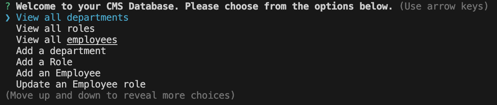

  From here we can choose 'View all departments':

  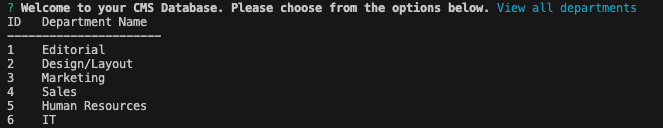

  We can 'View all roles' in the company:

  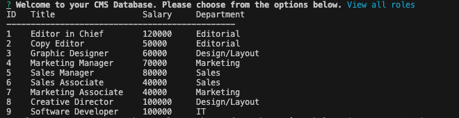

  And we can also 'View all employees':

  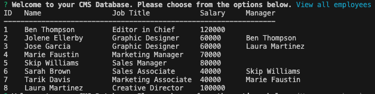

  We can also add a department where you will be asked to enter a new department name:

  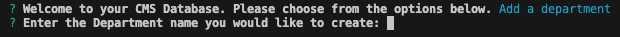
  
  This Department name will be stored and available to choose from the database for future prompts.

  We can also add a role:

  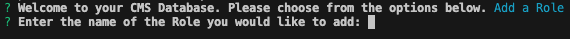

  You will then be asked for a salary for the role:

  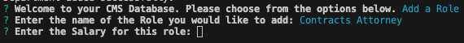

  And finally you will be asked to assign this role to a department by choosing from a list of departments:

  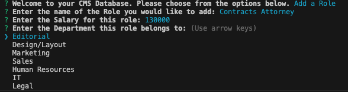

  This role will now also be stored and available to use for future prompts.

  You can also add an employee by entering their first and last name:

  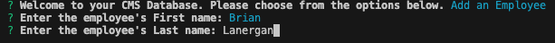

  And choosing a role for them:

  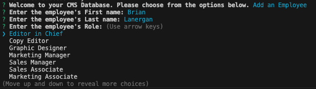

  Lastly you can update an employee by choosing their name from a list of stored employees and updating their role:

  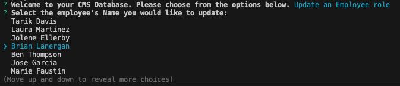
  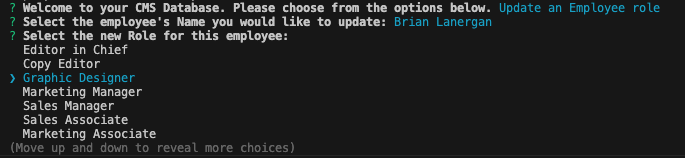

  You can exit the program by navigating to the quit selection from the main list of choices.

  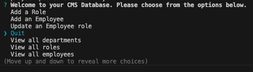

  ## Contribution
  After cloning the repository be sure to create a new branch for your feature or fix.
  Make your changes and commit them with descriptive messages.
  Submit a Pull Request with clear explanations of your modifications.
  Use meaningful variable names and comments.
  Follow guidelines for Javascript code formatting.

  ## Tests
  Below is a video link walkthrough of the program being run and test answers being given to show functionality.

  ## Questions
  - GitHub: [bjaegerthomas](https://github.com/bjaegerthomas)
  - Email: bjaegerthomas@gmail.com